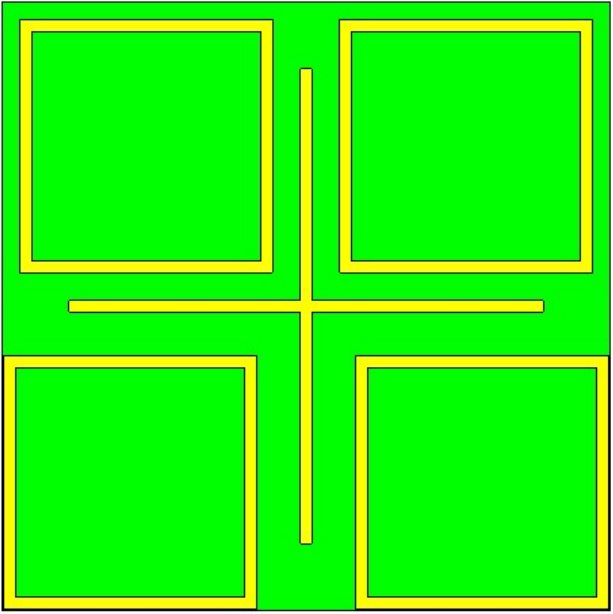

# MS-firstcode
the first code about metasurface

## 项目背景
本项目是超表面+深度学习的交叉方向。
超表面是一类薄型的，由人工设计的亚波长微单元结构周期性或非周期性排列构成的复合材料。当单元结构的尺寸小于入射电磁波波长时，可呈现出天然常规材料所不具备的超常电磁响应性质，实现对电磁波传播、反射、吸收等特性的灵活调控。
超表面的几何结构或者材料不同，对电磁响应的性质也不同。传统的超表面设计，是根据仿真软件获得的目标电磁响应，凭借经验手动调整超表面的几何结构或者材料配比。
但是这种方式效率极低，近年来研究者不断尝试结合深度学习、优化算法等方法，提高超表面设计的智能化、自动化水平。

## 项目概述
基于这一背景，本项目以多频吸波超表面为研究对象，实践了超表面设计中的两大场景：
1. **正向预测**: forward_prediction, 训练神经网络学习超表面几何结构（输入）与超表面电磁响应曲线（输出）之间的非线性关系，训练好的模型可以快速推理获得电磁响应曲线，从而替代运行时间较长的仿真软件。
2. **逆向设计**: inverse_design, 对于目标电磁响应曲线，运用粒子群算法寻找到最优超表面几何参数，从而设计出目标超表面。

## 多频吸波超表面
第一部分的正向预测模型训练需要数据集。
随机采样超表面几何结构，并用CST仿真软件获取对应的电磁响应-吸收光谱曲线。收集获得的数据存放在forward_prediction/input中。

<!-- 设置表格宽度100%， 合并边框 -->
<table style="width:100%; border-collapse: collapse;">
<!-- 一行 -->
  <tr>
  <!-- 一个单元格 -->
  <!-- 文字居中对齐，无内边距 -->
    <td style="text-align: center; padding: 0;">
      
    <!-- 说明文字的上外边距5px -->
      
超表面几何结构

    </td>
    <td style="text-align: center; padding: 0;">
      
      
电磁响应-吸收光谱曲线

    </td>
  </tr>
</table>

## 其他
具体项目流程分别见forward_prediction, inverse_design文件夹中的README.md