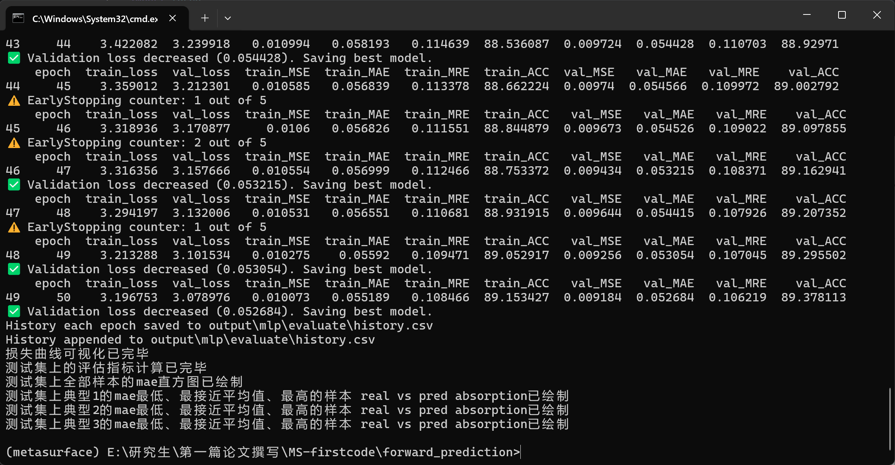

# 正向预测模型 (Forward Prediction Model)

## 项目概述

本项目实现了一个基于深度学习的超表面正向预测模型，用于预测给定几何结构参数下的吸收光谱曲线。
该模型输入7个几何结构参数，输出1001个采样点的S11值（归一化到[0,1]区间）。

## 项目结构

```
forward_prediction/
├── input/             # 输入数据
│   ├── dB_123.csv     # S11值数据
│   ├── label_123.csv  # 标签数据
│   ├── param_123.csv  # 几何参数数据
│   └── index/         # 训练/验证/测试集索引
├── network/           # 网络模型实现
│   ├── mlp.py         # MLP模型
│   └── ...            # 其他模型
├── train_main_dB2.py  # 主训练脚本
├── data_part.py       # 数据处理模块
├── evaluate_part.py   # 评估模块
├── save_part.py       # 保存模块
└── README.md          # 项目说明
```

## 核心功能

1. **数据处理**：支持数据加载、预处理、归一化和分层采样
2. **模型训练**：实现了早停机制、学习率调度和分层批处理
3. **模型评估**：计算MSE、MAE、MRE、ACC等指标，并生成可视化结果
4. **多种模型**：支持多种网络架构，如MLP等

## 环境依赖

- Python 3.7+
- PyTorch
- NumPy
- Pandas
- Matplotlib
- Scikit-learn

## 使用方法

### 1. 准备数据

确保输入数据文件位于 `input/` 目录下：
- `param_123.csv`：7个几何结构参数
- `dB_123.csv`：S11值（1001个采样点）
- `label_123.csv`：标签数据（用于分层采样）

### 2. 训练模型

运行主训练脚本：

```bash
python train_main_dB2.py [参数]
```

### 3. 命令行参数

| 参数         | 类型  | 默认值     | 描述                         |
| ------------ | ----- | ---------- | ---------------------------- |
| --batch_size | int   | 32         | 训练批次大小                 |
| --epoch_num  | int   | 100        | 训练轮数                     |
| --seed       | int   | 42         | 随机数种子                   |
| --input_dir  | str   | "./input"  | 输入数据目录                 |
| --output_dir | str   | "./output" | 输出结果目录                 |
| --save_index | flag  | False      | 是否保存训练/验证/测试集索引 |
| --model      | str   | "mlp"      | 使用的模型类型               |
| --lr         | float | 1e-4       | 学习率                       |
| --patience   | int   | 20         | 早停耐心值                   |

### 4. 示例命令

```bash
python train_main_dB2.py \
    --batch_size 64 \
    --epoch_num 200 \
    --seed 42 \
    --input_dir "./input" \
    --output_dir "./output/test_run" \
    --save_index \
    --model "mlp" \
    --lr 2e-3 \
    --patience 30
```

## 输出结果

命令行训练示例



训练完成后，输出结果将保存在指定的 `output_dir` 目录下：

```
output_dir/
├── model/                 # 模型相关
│   ├── best_model.pth     # 最佳模型权重
│   ├── model_epoch_*.pth  # 每轮模型权重
│   ├── hyperparameters.json  # 超参数记录
│   └── output.log         # 训练日志
└── evaluate/              # 评估结果
    ├── history.csv        # 每轮训练/验证/测试指标
    ├── prediction.csv     # 测试集预测结果
    ├── all_metrics.csv    # 每个样本的评估指标
    ├── metrics_summary.csv # 评估指标汇总
    ├── train_val_loss.pdf/png  # 训练/验证损失曲线
    ├── train_test_loss.pdf/png # 训练/测试损失曲线
    ├── mae_hist.pdf/png   # MAE分布直方图
    └── *sample.pdf/png    # 典型样本预测结果对比
```

## 模型评估

模型训练完成后，会自动进行评估并生成以下结果：

1. **损失曲线**：训练/验证/测试损失随轮数的变化
2. **评估指标**：MSE、MAE、MRE、ACC等指标的均值和标准差
3. **MAE分布**：测试集样本MAE值的分布直方图
4. **典型样本**：各类别（典型1、典型2、典型3）中MAE最低、最接近平均值、最高的样本预测结果对比

## 网络模型

目前支持的模型：

- **MLP**：多层感知器，基础模型
- **up_conv**
- 其他模型：可在 `network/` 目录下添加新的模型实现

## 数据说明

- **输入参数**：7个几何结构参数，归一化到[0,1]区间
- **输出数据**：S11值（1001个采样点），范围为[0,1]
- **标签数据**：用于分层采样，确保训练/验证/测试集中各类别分布均匀

## 技术亮点

1. **分层采样**：使用 `StratifiedBatchSampler` 确保每批次中各类别样本比例均衡
2. **早停机制**：当验证损失不再改善时自动停止训练，保存最佳模型
3. **学习率调度**：根据验证损失动态调整学习率
4. **详细评估**：提供多种评估指标和可视化结果，方便模型分析和改进
5. **灵活配置**：通过命令行参数控制模型训练的超参数，无需修改代码

## 注意事项

1. 确保输入数据格式正确，特别是 `param_123.csv`、`dB_123.csv` 和 `label_123.csv` 文件
2. 训练过程中会自动创建输出目录结构，无需手动创建
3. 模型训练可能需要较长时间，建议在GPU环境下运行
4. 若要使用自定义模型，需在 `network/` 目录下创建相应的模型文件，并确保实现 `forward_network` 类

## 许可证

本项目仅供学术研究使用。